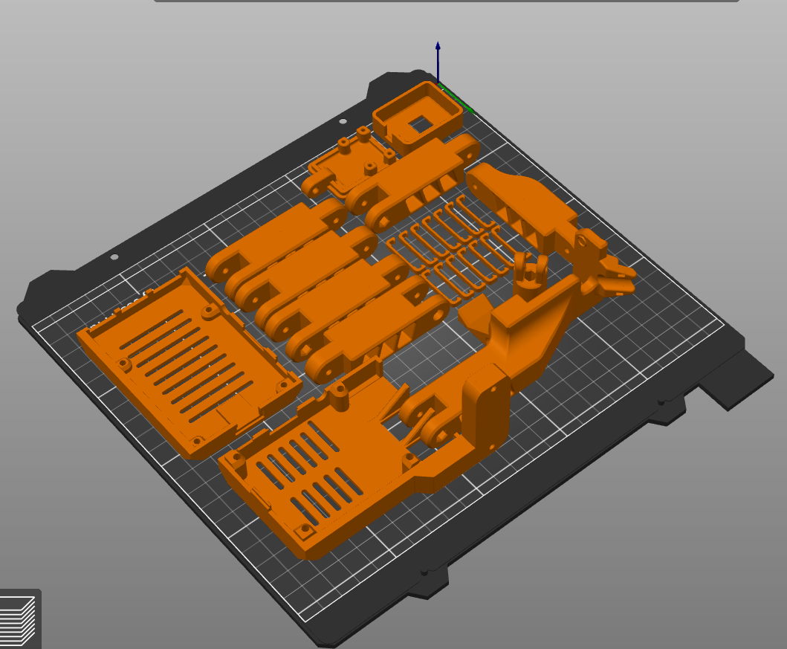

# Guide to turning your 3D printer to a wireless printer

This tutorial will walk through the process of turning your printer into a wireless printer using a Raspberry Pi. This tutiral is for people of all knowledge levels. You can follow the tutorial regardless if you have the same printer and Raspberry Pi. Just try to have fun and keep it neat!

### Technical Requirements:

#### Links can be found in the resources section at the end of the article

- Raspberry Pi model 3B(you can use other versions of the Raspberry Pi with modifications for the case).
- 32 or 64 GB Micro SD-Card (this tutorial uses 64 GB).
- Camera module with at least 1m long flex ribbon cable.
- USB type-A to USB type-B cable.
- M3 x 12mm/16mm/20mm screws.
- Computer or laptop.
- 3D printer (this tutorial uses a Prusa MK3S).
- Access to your router.

## Steps:
> ### Step 1 (Print Needed Parts):
>>> [Download](https://github.com/amrodewedar/3D-printing/blob/main/OctoPi_Full.3mf) the file for the Raspberry Pi enclosure, camera enclosure, and camera arm. 
>>> Make sure the enclosures and arm will fit your equipment before wasting precious fillament. 
>>> Slice and print the parts according to your prefrences (links in the resources section contains the thingiverse parts).
>>> 
>>> 
>>>
>>> .
> ### Step 2 (Assemble Parts):
>>> blah
> ### Step 3 (Installing Raspberry Pi Imager):
>>> First, [download](https://www.raspberrypi.com/software/) and install the Raspberry Pi imager.
>>> You should see the following after installing the imager and opening it:
>>> 
>>> 
>>> 
>>> .
> ### Step 4 (Install OctoPi Operating System on the Micro SD-Card):
>>> blah long step
> ### Step 5 (Connect to OctoPi and Setup):
>>> blah blah 
> ### Step 6 (Add Plugins):
>>> blah blah
>>
>>

## Resources:

- [Raspberry Pi model 3B](https://www.amazon.com/ELEMENT-Element14-Raspberry-Pi-Motherboard/dp/B07P4LSDYV/ref=sr_1_3?keywords=raspberry+pi+3b&qid=1660928794&sr=8-3)
- [64 GB Micro SD-Card](https://www.amazon.com/SanDisk-Ultra-microSDHC-Memory-Adapter/dp/B08GYBBBBH/ref=sr_1_3?crid=12FLPZJBR95S2&keywords=64+gb+micro+sd+card&qid=1660928910&sprefix=64+gb+micro+sd+card%2Caps%2C114&sr=8-3)
- [Pi Camera with a extended cable](https://www.amazon.com/gp/product/B07SN8HB1R/ref=crt_ewc_title_oth_2?ie=UTF8&smid=A2IAB2RW3LLT8D&th=1)
- [USB A/B cable](https://www.amazon.com/gp/product/B000067RMY/ref=crt_ewc_title_oth_3?ie=UTF8&psc=1&smid=ATVPDKIKX0DER)
- [Box of M3 screws of various lengths](https://www.amazon.com/binifiMux-360pcs-Countersunk-Phillips-Machine/dp/B08N5XDHMW/ref=sr_1_5?crid=3LE01UJH45QOO&keywords=M3+x+16+and+M3+x+12+screws&qid=1660322970&s=industrial&sprefix=m3+x+16+and+m3+x+12+screws%2Cindustrial%2C72&sr=1-5)
- [Website to download Raspberry Pi Imager](https://www.raspberrypi.com/software/)
- [Video tutorial of OctoPi and plugins installation](https://www.youtube.com/watch?v=HBd0olxI-No)
- [Video tutorial of camera and arm installation](https://www.youtube.com/watch?v=iFhVSmMzOLg&t=960s)
- [Raspberry Pi case model](https://www.thingiverse.com/thing:3004038)
- [Camera case and arm model](https://www.thingiverse.com/thing:4631375/files)
- [Pimp your printer with extruder visualizers](https://www.thingiverse.com/search?q=prusa+extruder+visualizer&page=1&type=things&sort=relevant)
