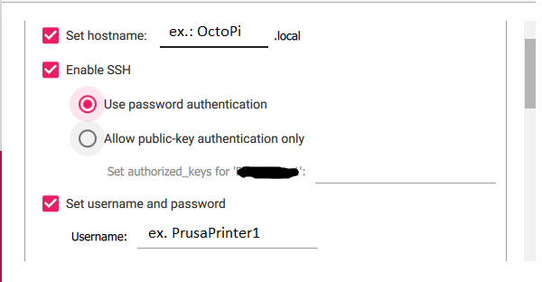

<!-- 
  
 -->

# Guide to turning your 3D printer to a wireless printer

This tutorial is a detailed walkthrough the process of turning your printer into a wireless printer using a Raspberry Pi. This tutorial is for people of all experience levels. You can follow the tutorial regardless if you have the same printer and Raspberry Pi. Just try to have fun and keep it neat!

### What you will need:

#### Links for the various parts can be found in the resources section at the end of the article

- Raspberry Pi model 3B(you can use other versions of the Raspberry Pi with modifications for the case).
- 32 or 64 GB Micro SD-Card (this tutorial uses 64 GB).
- Camera module with at least 1m long flex ribbon cable.
- USB type-A to USB type-B cable.
- M3 x 12mm/16mm/20mm screws.
- Computer or laptop.
- 3D printer (this tutorial uses a Prusa MK3S).
- Access to your router (may not need to).

> #### Everything you will need:
> 
> 
  

>
## Steps:
> ### Step 1 (Print Needed Parts):
>> - [Download](https://github.com/amrodewedar/3D-printing/blob/main/OctoPi_Full.3mf) the file for the Raspberry Pi enclosure, camera enclosure, and camera arm. 
>> - Make sure the enclosures and arm will fit your equipment before wasting precious fillament. 
>> - Slice and print the parts according to your prefrences (links in the resources section contain the thingiverse 3D design model parts).
>> - Depending on your camera position prefrence, you might want to print more links. With 5 links, the camera can be positioned in-front of the print bed. Keep in mind the more links you print the shakier the camera will be.
>> 
>> 
  

>>
>> .
> ### Step 2 (Arm & Camera Mount Assembly):
>> - Start by assembling the joints together using nuts and M3x20mm screws.
>> - The joints have designated holes for the screws and nuts, so make sure you are inserting them in the correct holes.
>> 
>> 
 

>>
>> - Next connect the arm mount to the rest of the links as such:
>> 
>> 
  

>> 
>> - Ensure that the last link (the one that will hold the camera enclosure) has the flat side up as shown in the picture above.
>> - Now connect the camera enclosure holder and camera enclosure to the rest of the assembly.
>> 
>> 
  

>> 
>> - The camera enclosure holder also has a nut hole but it is more difficult to place the nut in there, I used the hex-key that comes with the Prusa printer to put the nut in place. Also for the camera enclosure you can use a M3x16mm screw or ideally a M3x14mm screw.
>> - Now you can mount the arm to the Z-axis motor of the printer using a M3x20mm screw:
>> 
>> 
  
 
>>
>> Lastly zip-tie the Z-axis motor cable to the mount as such(disregard the ribbon cable for now): 
>> 
>> 
  

>>
> ### Step 3 (Raspberry Pi Assembly & Mount):
>>> #### Some things to keep in mind:
>>>> 
 - If you own a different printer find a case that will mount nicely on it. 

>>>> 
 - You could pass the ribbon cable through the Prusa Ensiy compartment (the metal compartment near the Z-axis motor). But be careful as you could short the Ensiy board if you use a metal probe to fish the ribbon cable at the other side. I reccomend using a piece of filament. 

>>>> 
 - If you have a different camera module or you are using a usb camera, plan for that and try to find or design the appropriate parts. 

>>
>> - First, place the heatsinks on the Processor and the LAN chips: 
>> 
>> 
  

>> 
>> - Place Pi in Case, releae the cable lock on the camera port by gently pulling on both sides of the black clip. Then connect the ribbon cable to the camera port so the contacts of the cable are touching the contacts of the Pi port:
>> 
>> 
   

>>
>> - Secure the cable in place by pushing on both sides of the port lock.
>> 
>> 
  

>> 
>> - Now pass the other end of the cable through the other side of the case and secure the case using 4 M3x16mm screws:
>> 
>> 
   

>> 
>> - Now mount the case to the printer using two M3x12 screws.
>> 
>> 
  

>> 
>> - Lastly, pass the the ribbon cable to the camera enclosure, connect the camera(through the slit in the camera enclosure), and clip the slack of the wire to the arm using the clips printed.
>> 
>> 
    

>> 
  

>> 
> ### Step 4 (Installing & Configuring OctoPi):
>> - First, [download](https://www.raspberrypi.com/software/) and install the Raspberry Pi imager.
>> - You should see the following after installing the imager and opening it:
>> 
>> 
  
 
>> 
>> - To burn the OctoPi operating system on the SD-Card:
>>> + Insert the SD-Card into your laptop.
>>> + For Operating System: CHOOSE OS -> Other specific-purpose OS -> 3D printing -> OctoPi -> OctoPi (stable)
>>> + For storage: CHOOSE STORAGE -> *select your SD-Card*
>> - You should see something simlair after you are done:
>> 
  

>> 
>> - Now select the gear in the bottom right corner to configure the Raspberry Pi.
>> - If you are comfortable configuring it, feel free to configure accordig to your prefrences. Here are my configurations and why:
>>> + Check "Set hostname", and give it a hostname. The hostname will allow you to search "*hostname*.local" instead of the Pi's IP address (at least in theory, more on that in the next step).
>>> + Check "Enable SSH" and "Use password authentication". This will enable you to connect to the Raspberry Pi through the internet. SSH is how you can connect to servers, but usually it's done in the background so you don't have to worry about it.
>>> + Check "Set username and password", and set the username and password. This is the same as having a username and password on your Windows or Mac computer.
>>> + Check "Configure wireless LAN" and enter your network's name and password. This will allow the Pi to connect to your router wirelessly. Make sure you enter those information correctly because changing them is somewhat of a hassle, it is easier to just overwrite the SD-Card and re-install the OS in order to change the network settings.
>>> + Lastly set "Wireless LAN country" accordingly.
>> - Here is a summary example of the selected configurations:
>> 
>> 
   

>> 
>> - Now click "Save" and "Write" to the SD-Card.
>> - Follow the instructions for installation, extract the SD-Card, and insert it into the mounted Raspberry Pi. Be careful when inserting the SD-Card, make sure it's going in the correct direction, and is going into the SD-Card slot. You shouldn't have to force it in.
>> 
>> 
  

>> 
> ### Step 5 (Connecting to OctoPi and Setup):
>> 
> ### Step 6 (Additional Actions):
>> 
>
>

## Resources:

- [Raspberry Pi model 3B](https://www.amazon.com/ELEMENT-Element14-Raspberry-Pi-Motherboard/dp/B07P4LSDYV/ref=sr_1_3?keywords=raspberry+pi+3b&qid=1660928794&sr=8-3)
- [64 GB Micro SD-Card](https://www.amazon.com/SanDisk-Ultra-microSDHC-Memory-Adapter/dp/B08GYBBBBH/ref=sr_1_3?crid=12FLPZJBR95S2&keywords=64+gb+micro+sd+card&qid=1660928910&sprefix=64+gb+micro+sd+card%2Caps%2C114&sr=8-3)
- [Pi Camera with a extended cable](https://www.amazon.com/gp/product/B07SN8HB1R/ref=crt_ewc_title_oth_2?ie=UTF8&smid=A2IAB2RW3LLT8D&th=1)
- [USB A/B cable](https://www.amazon.com/gp/product/B000067RMY/ref=crt_ewc_title_oth_3?ie=UTF8&psc=1&smid=ATVPDKIKX0DER)
- [Box of M3 screws of various lengths](https://www.amazon.com/binifiMux-360pcs-Countersunk-Phillips-Machine/dp/B08N5XDHMW/ref=sr_1_5?crid=3LE01UJH45QOO&keywords=M3+x+16+and+M3+x+12+screws&qid=1660322970&s=industrial&sprefix=m3+x+16+and+m3+x+12+screws%2Cindustrial%2C72&sr=1-5)
- [Website to download Raspberry Pi Imager](https://www.raspberrypi.com/software/)
- [Video tutorial of OctoPi and plugins installation](https://www.youtube.com/watch?v=HBd0olxI-No)
- [Video tutorial of camera and arm installation](https://www.youtube.com/watch?v=iFhVSmMzOLg&t=960s)
- [Raspberry Pi case model](https://www.thingiverse.com/thing:3004038)
- [Camera case and arm model](https://www.thingiverse.com/thing:4631375/files)
- [Pimp your printer with extruder visualizers](https://www.thingiverse.com/search?q=prusa+extruder+visualizer&page=1&type=things&sort=relevant)
